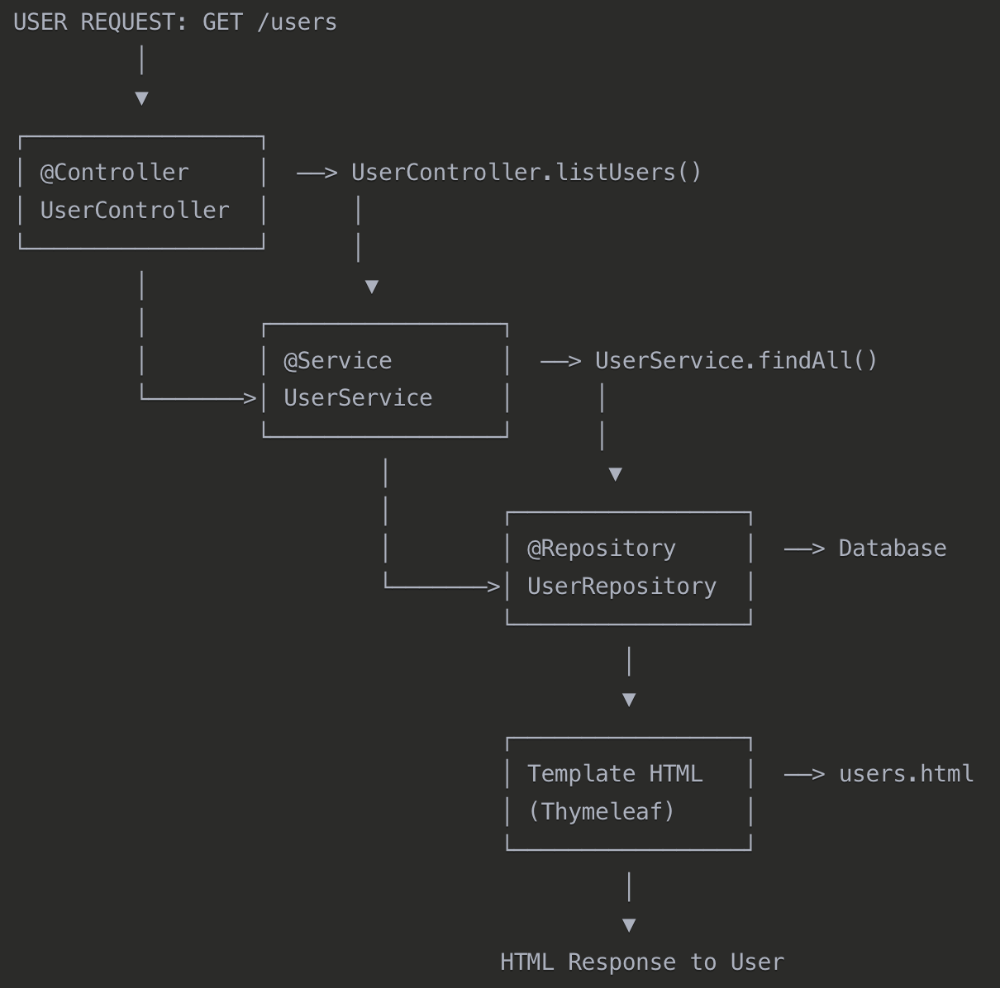

# Spring Web MVC
__Module__ de `Spring Framework` qui implémente le _pattern_ __Model-View-Controller(MVC)__ pour créer des applications web et `APIs REST`.

# Architecture MVC


# Flux de données


# Exemple avec Spring


# Pourquoi utiliser Spring MVC ?
- __Séparation des responsabilités__: Controller, Service, Repository.
- __Flexibilité__: Support des vues multiples(`HTML`, `JSON`, `XML`).
- __Testabilité__: Chaque couche peut être testé indépendamment.
- __Intégration__: S'intègre parfaitement avec `Spring Boot` et autres __modules__.

Avant de commencer __# Configuration de Base__, se référait à la _documentation_ __2.1.Maven.md__.

# Configuration de Base
__Dépendance Maven__:
```xml
<dependency>
    <groupId>org.springframework.boot</groupId>
    <artifactId>spring-boot-starter-web</artifactId>
</dependency>
```

__Configuration automatique__:
```java
@SpringBootApplication  // Active automatiquement Spring MVC
public class MyWebApp {
    // Entry Point
    public static void main(String[] args) {
        SpringApplication.run(MyWebApp.class, args);
    }
}
```

`SpringBootApplication`: Fait 3 choses en une:
- `@Configuration`: Cette __classe__ peut configurer des _beans_ `Spring`.
- `@EnableAutoConfiguration `: Active la configuration automatique de `Spring Boot`.
- `@ComponentScan `: Scanne automatiquement le _package_ courant pour trouver les _beans_.

_beans_: __Objet__ `Java` géré par `Spring`.

`SpringApplication.run(MyWebApp.class, args);`:
- `SpringApplication`: __Classe__ de `Spring Boot` qui démarre l'application via la méthode `.run()`.
- `MyWebApp.class`: Indication __classe__ utiliser comme configuration principale.
